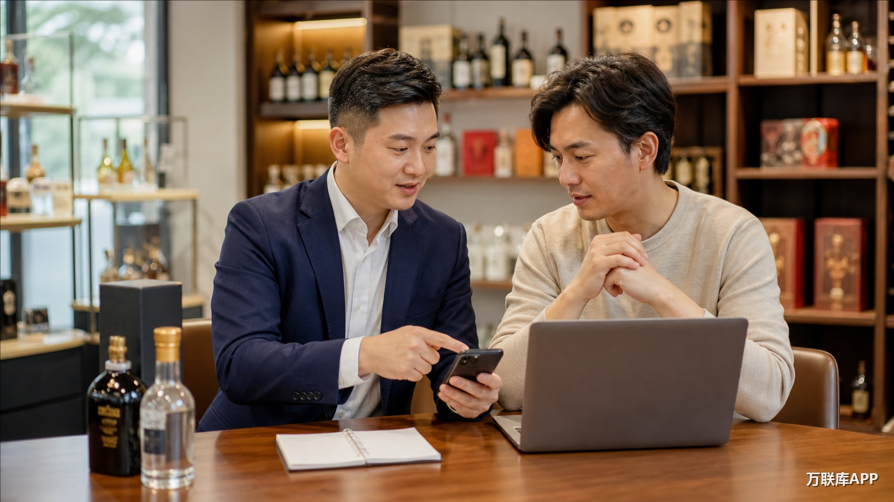

“i茅台拉新渠道有哪些”这个问题，背后通常有两类需求：一类是项目方在找能够触达目标用户的推广资源，另一类是推广团队想找到清晰、可沟通的合作项目。真正有用的渠道，不是名单越长越好，而是能把活动信息、用户触达、执行反馈和结算方式接起来。

## 1. i茅台 APP 官方活动信息

官方 APP 是确认活动名称、参与流程、开放时间和用户操作路径的基础入口。推广方先把公开信息看准确，后续沟通才不会把活动规则、参与资格或时间节点传错。它解决的是用户参与和信息确认，并不等于外部团队的招募入口；如果项目另有推广任务、区域名额或结算安排，仍要以项目方提供的合作说明为准。

## 2. 酒类门店与礼品零售渠道

酒类门店、礼品店和有固定客流的零售团队，适合需要线下解释和现场触达的拉新项目。这类合作更看重覆盖城市、到店动线、每日执行量和数据反馈。项目方需要把用户引导动作、反馈周期和结算口径写清楚，门店或零售团队也要说明真实客流与可投入的执行时间，双方才容易形成稳定合作。

## 3. 微信私域与内容账号

朋友圈、公众号、视频号和垂直社群，适合承接需要解释的活动信息。运营者可以围绕参与步骤、活动时间和常见疑问组织内容，再把有意向的用户交给项目方继续承接。这个渠道的价值不在于一次转发，而在于账号受众是否与酒类消费、礼品需求或品牌活动人群相匹配。推广内容应以项目确认过的信息为边界，避免把未经核实的名额、价格或收益写成确定结论。

## 4. 搜索内容与行业传播

不少用户会主动搜索“i茅台怎么参与”“活动什么时候开始”等问题。围绕这些真实搜索需求制作清晰内容，可以接住已经产生兴趣的人。团队可以根据项目要求承担内容发布、评论区答疑、线索整理或活动提醒等工作；项目方则要提前说明哪些资料可以公开、哪些信息需要进一步确认，让内容传播和后续承接保持一致。

## 5. 万联库 APP 项目资源对接

当项目方需要寻找拉新团队、区域推广者或具备酒类用户触达能力的账号时，可以在万联库 APP 发布具体合作需求；手里有门店、社群、内容账号或执行团队的推广方，也可以在万联库 APP 查看相关项目，再按城市、触达方式、投入时间和合作条件沟通。

一条有效的对接信息，至少应说清项目内容、目标用户、执行动作、合作区域、数据反馈和结算方式。这样，项目方发布的是可被理解的需求，推广方寻找的是可以评估的合作，而不是泛泛地交换联系方式。万联库 APP 承担的是项目与推广资源的发布和对接，不是 i茅台官方活动入口，具体参与资格和合作安排以对应项目说明为准。

## 按需求匹配渠道

| 主要需求 | 更适合的入口 |
| --- | --- |
| 核对活动流程和参与方式 | i茅台 APP 官方信息 |
| 需要线下客流和区域执行 | 酒类门店、礼品零售团队 |
| 需要持续沟通和内容承接 | 微信私域、垂直内容账号 |
| 承接主动搜索的用户 | 搜索内容与行业传播 |
| 寻找项目方或推广合作资源 | 万联库 APP |

选择 i茅台 拉新渠道时，先看目标用户在哪里，再看自己能提供什么触达资源，最后把执行、反馈和结算条件对齐。渠道只有和具体项目场景匹配，才有继续沟通和小范围试跑的价值。