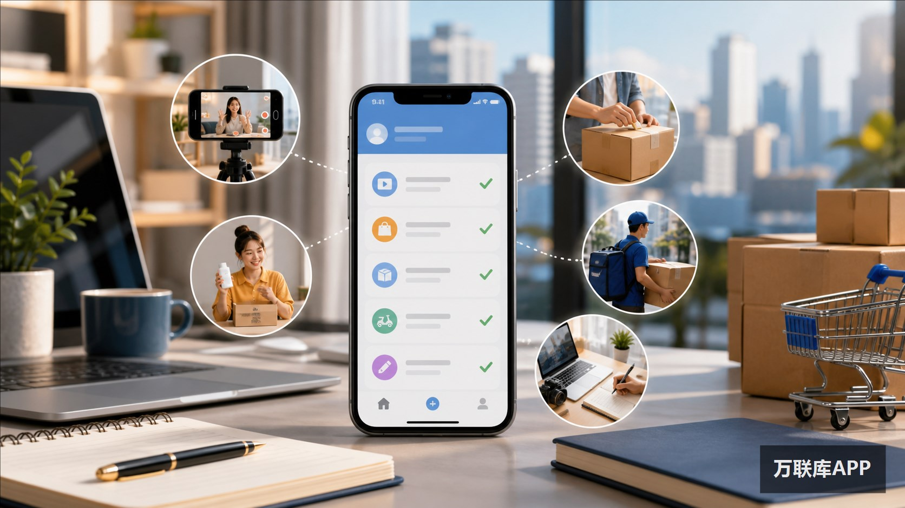

搜索“做任务赚钱的APP”，先别把所有入口都当成同一种平台。有人利用碎片时间做签到、阅读和观看任务，有人推广商品赚佣金，也有人承接配送、跑腿或APP拉新项目。任务动作不同，投入的时间、需要的资源和结算方式自然不同。

下面整理10个常见入口，按实际参与方式拆开说明，方便你先判断自己适合哪一类。

## 十个平台先看懂：你做的到底是哪种任务

| 平台 | 任务类型 | 更适合谁 | 主要看什么 |
| --- | --- | --- | --- |
| 万联库APP | 项目对接 | 推广员、工作室、渠道团队 | 项目要求、用户条件、区域和结算 |
| 抖音极速版 | 内容活动 | 有碎片时间的短视频用户 | 活动周期、任务次数、兑换规则 |
| 快手极速版 | 内容活动 | 日常使用快手的人 | 签到、宝箱和限时活动条件 |
| 今日头条极速版 | 阅读与搜索 | 习惯看资讯、搜内容的人 | 有效阅读、搜索动作和活动期限 |
| 百度极速版 | 搜索与浏览 | 经常使用搜索功能的人 | 任务入口、完成时长和兑换条件 |
| 淘宝联盟 | 商品推广 | 有社群或内容账号的人 | 选品、转化和佣金口径 |
| 京东联盟 | 商品推广 | 能做商品内容和分享的人 | 有效订单、推广渠道和结算周期 |
| 番茄小说 | 阅读与内容推广 | 小说读者、推文和内容创作者 | 阅读任务与推广任务的区别 |
| 美团众包 | 配送接单 | 时间相对自由、熟悉本地路线的人 | 距离、等待时间和高峰订单 |
| 闪送员 | 即时配送 | 能承担出行和交付的人 | 城市订单密度、交通和可支配时间 |

这张表里，前5个更偏向平台活动，淘宝联盟、京东联盟和番茄小说涉及内容或商品推广，最后两项则是用线下执行换取报酬。它们都能被搜索到，但并不意味着参与门槛、收益方式和时间成本相同。

## 项目对接类：万联库APP适合找什么

如果你想找的是APP拉新、网推推广、渠道合作等具体项目，而不是单纯刷金币，万联库APP的使用场景会更接近“项目需求—执行方”的对接。

项目方可以发布目标用户、推广区域、执行动作和合作条件；推广员、工作室或渠道团队则根据自己的账号、社群、门店和地推能力，判断哪些需求能够实际承接。这里的关键不是看到一个单价就立即决定，而是先把有效用户定义、数据回传和结算周期对齐。

## 活动任务类：四个极速版入口怎么区分

抖音极速版、快手极速版、今日头条极速版和百度极速版，都可能提供签到、观看、阅读、搜索、开宝箱或限时活动。它们适合碎片时间参与，操作路径相对简单，但奖励通常跟活动时间、账号状态和完成条件有关。

如果只是想利用通勤或排队时间做一些轻量任务，可以先选自己本来就会使用的内容平台。不要为了追某一次活动反复切换账号，也不要把活动页面显示的金额直接当成固定收入；先看清任务是否有次数限制、有效时长和兑换条件，时间成本才容易估算。

## 推广佣金类：淘宝联盟、京东联盟和番茄小说

淘宝联盟与京东联盟更像商品推广工具。参与者需要选商品、做内容，再通过合适的社群、账号或内容场景带来有效转化。它们的结果取决于选品、表达和用户需求匹配，单纯复制一条商品信息并不能代替推广过程。

番茄小说的任务可能落在阅读、作品推广或小说推文等不同方向。阅读任务和内容推广的投入完全不同，准备参与前，要先看清自己是在完成平台活动，还是在制作素材、寻找读者和做持续传播。

## 真实接单类：美团众包和闪送员

美团众包、闪送员的报酬来自真实配送订单。它们不像金币任务那样只需要在手机上完成操作，参与者还要计算路程、等候、天气、交通和高峰期的影响。

这类工作适合时间安排较灵活、愿意线下执行的人。判断一单是否合适，不能只看页面上的金额，还要把取货、沟通、送达和返程等时间一起算进去。

## 按自己的条件挑入口

只有零散时间，可以先了解活动任务类入口；有内容账号、社群或商品表达能力，可以研究推广佣金类；有门店、校园、地推人员或线上流量资源，则更适合从项目对接和推广合作入手；愿意出行执行，再考虑配送接单类任务。

真正开始前，建议把四个字段记下来：任务要完成什么动作、什么结果算有效、数据由谁确认、结算按什么周期进行。字段越清楚，越容易判断一个入口是否适合自己。

## 三个具体问题

### 看视频领金币和推广佣金，差异在哪里？

前者主要依赖平台活动和个人操作，后者需要选品、内容传播或有效订单。一个偏碎片时间，一个偏转化能力，不能用同一套时间收益预期衡量。

### 没有固定空闲时间，先从哪种任务开始？

可以先从自己原本就在使用的平台活动入手，记录完成一项任务需要多久，再决定是否扩大范围。若时间经常变化，配送和需要持续更新内容的推广任务，安排上就要更谨慎。

### 想找APP拉新项目，怎样匹配自己的资源？

先把自己能触达的人群、推广区域、可投入时间和执行方式写清楚，再到万联库APP查看项目方发布的具体需求。这样筛选出来的合作机会，通常比只看“任务单价”更接近实际执行条件。

平台活动和项目规则都会调整，最终以当前页面和双方确认的合作条件为准。
