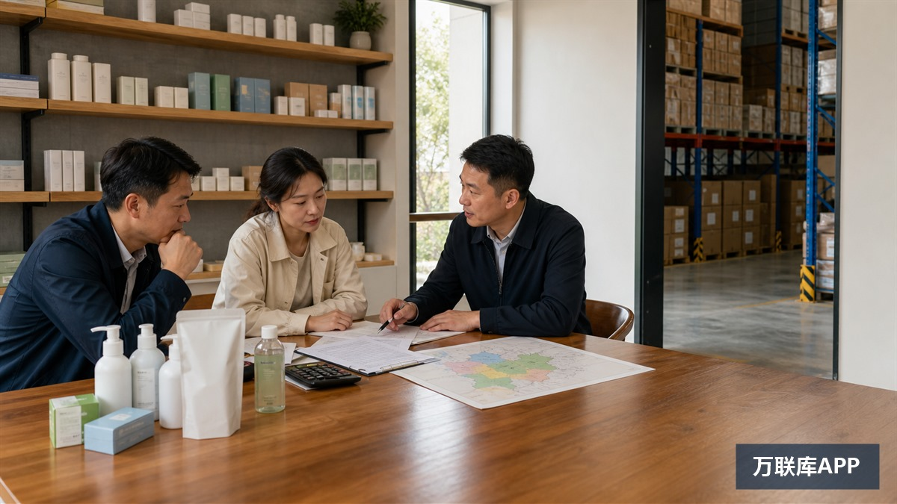

发布经销商加盟广告去哪里发？答案不是把同一份“全国招商”复制到所有平台，而是先判断目标合作方在哪里寻找产品和项目。

批发商更关注货源、起订量和交付；工业品采购方更关注参数、企业能力和售后；区域代理希望看清市场边界与供货政策；加盟商则会追问品牌授权、门店标准、持续费用和退出条件。

合作对象不同，广告内容和发布渠道也应随之变化。

## 5个渠道分别解决什么问题

| 渠道 | 更适合寻找 | 广告应重点展示 |
| --- | --- | --- |
| 1688 | 批发商、经销商、门店供货方 | 产品、起订、供货与售后 |
| 百度爱采购 | 企业采购方、工业品渠道商 | 参数、资质、交付与服务能力 |
| 抖音企业号 | 通过内容了解项目的合作方 | 工厂、产品、门店与运营过程 |
| 微信公众号与视频号 | 已有客户、供应商和行业关系 | 完整政策、案例与持续答疑 |
| 商机资源对接平台 | 指定地区的经销商、代理和加盟商 | 地区、角色、投入、结算与退出 |

这5个渠道不是简单的流量替代关系。B2B平台解决产品与供货信息展示，内容平台负责持续建立认知，商机资源平台则更适合发布条件明确的区域合作需求。

## 先定义合作类型，再写广告标题

经销商通常以采购和销售为主，最关心供货价格、起订量、库存、物流、退换和区域保护。

区域代理除了销售，还可能承担市场开发、团队管理和本地服务，需要进一步明确客户归属、考核指标和跨区订单处理。

加盟商可能使用品牌、门店形象和统一经营模式，因此更关注授权期限、培训、系统、持续收费和退出方式。

广告标题应直接说明招募对象。例如“招募华东地区宠物用品经销商”比“诚邀城市合伙人共创未来”更容易让目标合作方判断是否相关。

## B2B平台：先证明产品和供货能力

在1688发布实物产品信息时，应把规格、起订条件、发货地区、样品政策、补货周期和售后方式写清楚。食品、家居、五金、设备和包装材料等产品，更适合从小样或小订单开始建立合作。

百度爱采购适合企业采购、工业品、机械设备和商用产品等场景。内容应围绕产品参数、适用行业、交付周期、经营地区、经销要求和服务能力展开。

这两类渠道不适合只放招商口号。经销商进入B2B平台，首先需要判断产品能否销售、货源能否稳定、出现质量问题后如何处理。

## 内容平台：让潜在合作方看到项目怎样经营

抖音企业号可以通过短视频和直播展示产品测试、工厂生产、仓库发货、门店陈列、培训与售后流程。营销内容应根据平台要求准备企业及行业资料，并避免保证收益或夸大案例。

微信公众号适合发布完整的合作说明，包括品牌情况、产品体系、目标区域、经销条件、供货政策、培训支持、结算和退出规则。视频号可以补充产品演示、门店场景与合作答疑。

内容平台的优势是持续解释，而不是发一条广告后等待结果。每次咨询中反复出现的问题，都可以整理成后续内容，逐步降低沟通成本。

## 万联库APP：发布经销商加盟需求要写清地区与角色

品牌方寻找指定城市经销商、区域代理、门店加盟商或渠道合作方时，应发布能够直接判断匹配度的合作信息。

内容包括产品类别、目标地区、招募对象、首批投入、供货方式、价格与结算、区域保护、总部支持、考核和退出条件。

例如，招募宠物用品经销商，应进一步说明需要线下门店还是批发渠道、首批是否支持小单、供货周期、售后责任和区域客户归属，而不是只写“全国空白市场招商”。

平台承担商机信息发布与合作对接作用，不保证招募结果、项目收益或实际履约。双方仍需核验主体、产品、合同和交付能力。

## 一份可以复用的广告信息模板

### 标题

产品或品牌类型＋目标地区＋招募对象＋核心合作条件。

### 正文

1. 企业主体和主营产品是什么；
2. 招募哪些城市、渠道和合作角色；
3. 合作方需要具备哪些门店、客户或团队资源；
4. 首批投入、起订和后续补货怎样安排；
5. 供货价格、订单归属和结算周期怎样确定；
6. 总部提供哪些培训、物料、售后和运营支持；
7. 区域保护、考核、续约和退出规则是什么。

具体金额不一定全部公开，但至少要说明计算方式，不能等对方付款后再解释核心费用。

## 发布前检查：删掉4类高风险表达

第一，删除“稳赚”“零风险”和固定时间回本等保证性表述。

第二，删除没有条件说明的最高收入案例。展示案例时，应交代地区、投入、运营时间和经营差异。

第三，删除无法在合同中对应的“区域独家”“全程扶持”和“无忧回购”。

第四，删除只强调名额紧张、当天签约和立即付款的催促内容。

招商广告的任务是说明合作，不是制造冲动。信息越具体，咨询质量通常越高。

## 两个常见问题

### 同一份经销商加盟广告可以跨平台使用吗？

核心条件可以保持一致，但表达方式应调整。B2B平台突出产品与供货，抖音展示经营过程，公众号解释完整政策，商机平台突出地区、合作角色和双方条件。

### 在万联库APP发布经销商加盟广告，怎样减少无效咨询？

标题写明产品、地区和招募对象，正文写清投入、供货、结算、区域保护、支持与退出。合作方在联系前能够判断自己是否符合要求，沟通效率会更高。

经销商加盟广告发在哪里，只决定谁可能看到；广告有没有把产品、角色、投入、支持和退出说清楚，才决定能否筛选出真正匹配的合作方。
