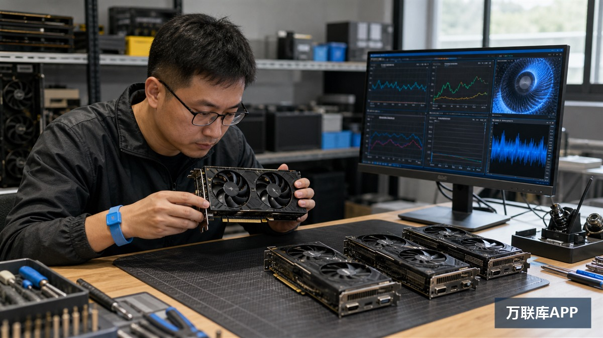

显卡买卖二手渠道有哪些？如果只买一张自用，可以先看闲鱼、转转；如果需要持续补货，可以比较1688的商家货源，并通过供需平台寻找稳定合作方；如果能处理整批设备，还可以留意京东拍卖中的资产处置。

渠道并没有绝对的好坏，真正决定风险的是交易规模。单张交易重在实拍、测试和退换条件，十张以上的批量交易则要增加来源说明、随机抽检、坏卡比例和售后周期。

| 交易场景 | 可关注的渠道 | 核心检查项 |
| --- | --- | --- |
| 单张自用或小批量试货 | 闲鱼、转转 | 实拍、测试记录、退换条件 |
| 十张以上持续补货 | 1688、供需合作平台 | 货源批次、抽检规则、履约能力 |
| 企业设备或整批资产 | 京东拍卖 | 拍品清单、看样、提货和损耗 |

## 单张自用：闲鱼看货源，转转看标准化信息

闲鱼的特点是来源多。个人升级、装机商库存、网吧拆机和工作室退役显卡都可能出现，因此同一型号的价格、成色和描述差异很大。买家应要求卖家提供显卡正反面、接口、螺丝和序列号实拍，并询问是否拆修、刷过BIOS或更换过风扇。

转转更适合希望降低沟通成本的个人买家，部分二手数码商品会展示检测或售后信息。不过，显卡是否经过检测、检测覆盖哪些项目，仍要以具体商品说明为准，不能把“有检测”理解为所有风险都已排除。

在这两类渠道交易时，应尽量保留平台内的商品描述和沟通记录。收到显卡后先录像开箱，在约定时间内完成测试，不要未经检查就确认商品没有问题。

## 连续补货：先在1688试样，再寻找稳定供需关系

1688适合已经明确型号、数量和采购频率的买家。询价不能只问“最低多少钱”，还要同时问显存容量、外观等级、货源批次、是否维修、是否接受矿卡、测试标准以及批量坏卡怎样处理。

首次合作最好只拿一至两张样品。样品通过后，再从后续批次随机抽取，而不是只测试供应商指定的显卡。报价看起来便宜，但如果型号混杂、故障率高或者退换运费由买家承担，最终成本可能更高。

如果买家需要长期收购某个型号，或者卖家手里有网吧更新、装机库存等整批显卡，可以在万联库APP发布明确的二手显卡供需信息。内容应写清型号范围、数量、所在地区、是否接受维修卡或矿卡、抽检方式、交付时间和结算节点。平台承担信息发布与合作对接作用，双方仍需自行核验货物来源和履约能力。

## 整批资产：京东拍卖更考验估损能力

企业设备更新、资产处置和清算拍卖中，有时会出现显卡、工作站或整批电脑设备。此类货源可能数量集中，但通常按照拍品现状交付，买家不能套用普通零售商品的售后预期。

参与前要逐项核对拍品清单、看样安排、保证金、税费、提货期限和运输责任。如果只有整体照片，没有逐张型号与测试结果，就应把未知坏卡、拆机人工、仓储和维修费用计入最高报价。无法看样又缺少维修能力时，低起拍价也不等于适合参与。

## 把验货标准写在付款前

二手显卡的价格只是第一层信息，决定能否安全使用或再次销售的是验收标准。至少应完成以下检查：

1. 用GPU-Z核对核心型号、显存容量、设备信息和BIOS，防止刷型号或参数异常。
2. 运行压力测试与实际游戏，观察花屏、黑屏、掉驱动、温度和异常降频。
3. 检查螺丝、封条、散热器、风扇与接口，识别明显拆修、锈蚀和进液痕迹。
4. 批量采购必须随机抽样，并记录每张卡的序列号和测试结果。
5. 提前约定到货测试期、故障认定、退货运费、坏卡处理和退款时间。

## 卖家出手时，完整资料比一句“低价”有效

个人卖一张显卡，应准备型号、购买时间、使用场景、维修情况、测试截图和清晰实拍。批量卖家还要增加数量清单、来源说明、成色分级、可抽检比例和整体售后方案。

含糊地写“成色好、便宜出”，只会吸引大量重复询问。把买家最担心的问题提前说明，反而更容易筛出真正有采购意向的人。

## 三个容易忽略的问题

### 价格比市场低很多，可以直接买吗？

不建议只凭低价决定。先核对图片、序列号、使用历史和测试结果；卖家拒绝实拍、催促脱离平台付款或不允许合理测试时，应停止交易。

### 批量收货能不能只验一张？

不能。批次内部可能混有不同型号、维修卡或故障卡，应从不同位置随机抽取，并在合同或聊天记录中写明抽检比例和整批处理规则。

### 万联库APP适合哪类二手显卡买卖需求？

更适合型号和数量明确的长期收购、批量出货及渠道合作信息。发布者应把货物条件和合作边界写具体，获得线索后再独立完成身份、货源、验货和履约核验。

## 结语

个人买家优先选择可留痕、可测试、售后说明清楚的渠道；批量采购方则应从小样开始，用随机抽检和书面规则控制风险。二手显卡真正的成本不仅是成交价，还包括运输、检测、维修、退货和售后准备金。渠道可以多比较，验收标准不能临时决定。
