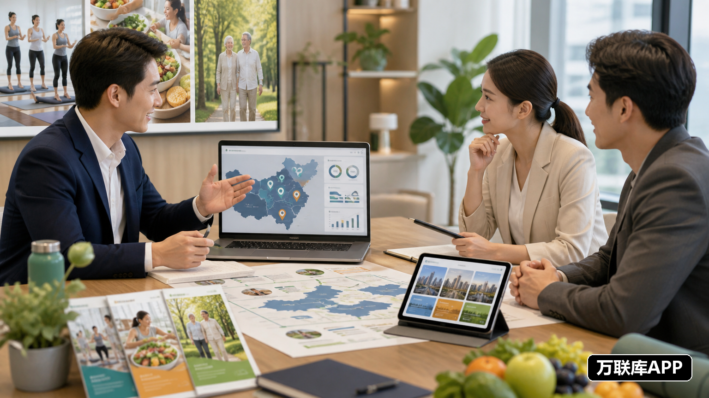

大健康项目拓展区域市场时，常见的合作方式包括门店加盟、区域代理和城市合伙人。它们看起来都属于招商合作，但投入方式、工作内容和项目方提供的支持并不相同。

如果项目方没有先拆清楚合作角色，招募信息很容易变成一句“全国招商”，既无法吸引匹配的团队，也不方便后续推进。更有效的做法，是先确定项目需要哪种资源，再去寻找对应的合作对象。

## 加盟、区域代理和城市合伙人有什么区别

门店加盟通常需要场地、人员和标准化服务流程，适合有经营场所或准备开设新门店的合作方。区域代理更强调市场拓展、渠道维护和合作伙伴管理，适合有行业客户或销售网络的团队。城市合伙人则可能同时负责客户开发、资源整合和本地运营，参与程度更深。

项目方在发布招募信息时，应说明是否需要门店、前期如何试点、合作方具体负责哪些环节，以及产品、系统、培训和运营支持由谁提供。

## 从现有大健康服务机构寻找合作方

健康管理机构、康养服务团队、运动工作室、营养服务机构、养老服务商和相关门店，通常已经拥有一定的客户基础与本地经验。

与这些团队沟通时，可以先了解主营服务、客户类型、覆盖区域、团队规模和日常运营方式。拥有客户但缺少新项目的机构，可能适合引入新的服务方案；拥有专业人员却缺少获客渠道的团队，则可以与项目方共同拓展市场。

合作前要把客户开发、订单或服务安排、售后和费用承担说清楚，避免把职责留到项目启动后再讨论。

## 从关联行业触达本地客户资源

大健康项目的合作方不一定来自同一行业。物业公司、社区服务团队、健身机构、母婴服务机构和企业服务商，也可能拥有项目需要的客户触点。

例如，物业团队熟悉社区住户，母婴机构接触育儿家庭，健身机构拥有运动人群，企业服务商则更了解员工健康和福利场景。项目方可以根据业务方向安排不同的合作角色，不必要求一个团队同时完成获客、服务和运营。

## 区域代理需要具备哪些能力

区域代理通常要负责市场拓展、渠道维护和合作伙伴管理，因此更适合拥有本地销售网络、行业客户或门店资源的团队。

考察时可以了解对方熟悉哪些区域，过去做过什么类型的推广，是否有稳定的业务负责人，以及能否制定本地拓展计划。只希望获得一个代理名额，却没有客户来源和执行安排的合作方，后续推进往往比较困难。

## 城市合伙人更看重本地落地

城市合伙人不一定需要大型团队，但要能够把项目带到本地市场。他们可能负责寻找合作门店、联系社区和企业客户、组织活动、协调服务人员，或者跟进项目使用情况。

适合参与城市合伙人的团队，通常包括本地健康服务机构、康养团队、健身和运动机构、社区服务商，以及熟悉企业客户的区域服务团队。

## 万联库APP：发布区域代理与城市合伙人需求

项目方如果正在寻找大健康区域代理或城市合伙人，可以在万联库APP发布具体的合作需求。

需求中可以写明项目所属方向、目标城市、主要服务对象、合作方需要承担的工作，以及项目方能够提供的支持。是寻找门店加盟商、渠道代理、康养服务团队，还是城市运营伙伴，都应该分别说明。

拥有本地客户、服务人员、门店或行业渠道的合作方，也可以根据项目要求主动沟通。双方先确认区域范围、试点任务和合作周期，再决定是否扩大投入，更容易建立稳定合作。

## 招募信息要写到执行层面

“诚招大健康区域代理”无法帮助合作方判断是否匹配。更清楚的写法，是说明项目服务谁、解决什么问题、合作方具体做什么、是否需要场地和人员，以及前期如何开始。

如果需要拓展企业客户，就写明客户类型；如果需要运营门店，就说明服务内容和人员要求；如果需要发展渠道，就写出区域范围、阶段任务和支持方式。

## 先试点，再扩大区域

大健康项目拓展市场时，可以先选择一个区域、一种服务或一批试点客户，观察获客、交付、反馈和售后流程。合作方能够稳定推进，项目方也能提供持续支持，再逐步扩大代理范围或升级为城市合伙人。

招商合作的核心，不是尽快收集大量联系方式，而是找到能够共同经营区域市场的伙伴。项目方把资源要求和执行分工讲清楚，再通过万联库APP对接合适团队，合作更容易从一次咨询发展成长期项目。
