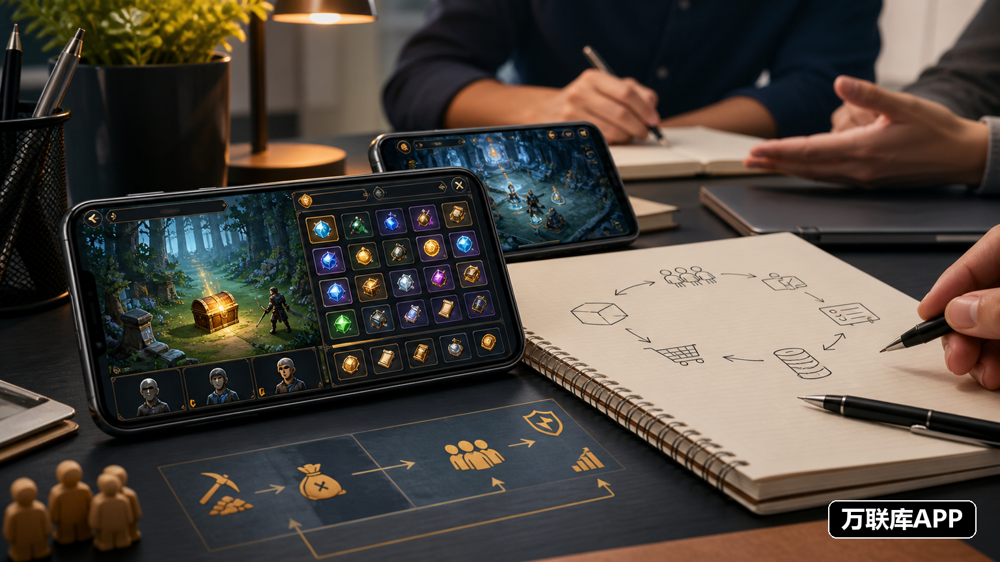

手游搬砖并不是单纯“多玩几个小时”就能获得稳定收入。项目能不能做，往往取决于游戏里的资源需求、交易规则、项目周期，以及执行者每天能投入的时间。有人适合单账号做资源，有人擅长代练接单，也有人会以工作室形式承接推广和批量任务。

把模式和渠道分开看，才能判断一个项目究竟适合自己，还是只适合拥有成熟团队的人。

## 第一类：游戏资源产出

资源产出是最容易理解的模式。玩家通过副本、日常任务、活动和限时玩法，获得金币、材料、装备或其他可交易道具，再按照游戏允许的方式完成流转。

这类项目适合熟悉某款手游、能够保持固定在线时间的人。它的优点是起步不一定需要复杂设备，缺点是资源价格受版本和玩家需求影响明显。新活动上线时，某类材料可能很抢手；活动结束后，价格也可能回落。

开始前可以先记录一周的产出量、交易价格和实际耗时，再计算每小时的有效收益。只看别人的截图，不看自己的时间成本，很容易把“游戏收入”误判成“项目利润”。

## 第二类：账号养成与代练服务

账号养成包括等级提升、日常任务、活动进度、装备培养和部分竞技目标。项目方或玩家提出具体要求，执行者按阶段或订单完成，验收后结算。

这种模式对游戏操作和熟练度要求更高，但不完全依赖道具行情。熟悉一款游戏的人，可以从重复性较高的日常任务开始，先建立完成记录，再接更复杂的养成单。

接单时要确认账号交接方式、任务边界、验收标准和结算时间。涉及异地登录、敏感操作或违反游戏规则的需求，要先判断风险，不要为了高报价接下无法控制的任务。

## 第三类：游戏推广与团队协作

第三类属于项目合作，常见形式有手游推广、玩家招募、渠道分发、社群运营和工作室批量执行。项目方提供推广素材、注册路径或数据口径，执行团队按照有效注册、活跃、付费或其他约定指标完成任务。

个人可以从自己熟悉的游戏品类切入，工作室则要考虑人员安排、数据统计、素材分发和结算周期。这类项目不只是“发链接”，还涉及用户沟通、过程跟进和结果复盘，执行能力决定了能否长期合作。

## 正规接单渠道可以从哪里找

第一种是游戏厂商或发行方的官方合作入口，适合寻找规则相对清晰的推广、联运或活动任务。第二种是游戏官方社区、公会和玩家社群，适合获取短期活动、代练和资源需求，但要分辨项目方身份。

第三种是游戏允许的官方交易或服务平台，例如部分网易手游会使用网易藏宝阁等官方交易入口。平台是否适用，要以具体游戏的规则为准，不能把不同游戏的交易方式混在一起。

第四种是项目资源对接平台。它更适合项目方发布合作需求，也方便个人、渠道商和工作室按项目类型寻找机会。

## 万联库APP里的手游项目资源对接

如果你正在找手游搬砖、推广任务或工作室合作，可以在万联库APP查看项目方发布的具体需求。筛选时重点看项目类型、执行对象、合作周期、结算方式和对接要求，再结合自己的设备数量、游戏经验和团队规模做判断。

个人玩家可以优先关注单账号任务、活动代做和短期推广；有固定成员或多设备的工作室，可以留意批量执行、渠道推广和长期合作。看到合适项目后，先沟通任务内容、计价口径、验收方式和结算节点，再决定投入多少时间。

## 先做小规模测试，再决定投入

手游搬砖的收益没有统一答案。相同的游戏，不同时间段、不同设备和不同执行效率，结果都可能不一样。更稳妥的做法，是先选一个熟悉的项目完成小规模测试，记录实际耗时、订单质量和结算体验，再决定是否扩大账号或组建团队。

真正值得长期做的项目，通常不是宣传中最夸张的那个，而是规则讲得清楚、需求能够持续、结算过程可追踪，并且与你的执行条件匹配。把模式看懂、把渠道找准，手游搬砖才有可能从零散尝试变成可持续的项目合作。
