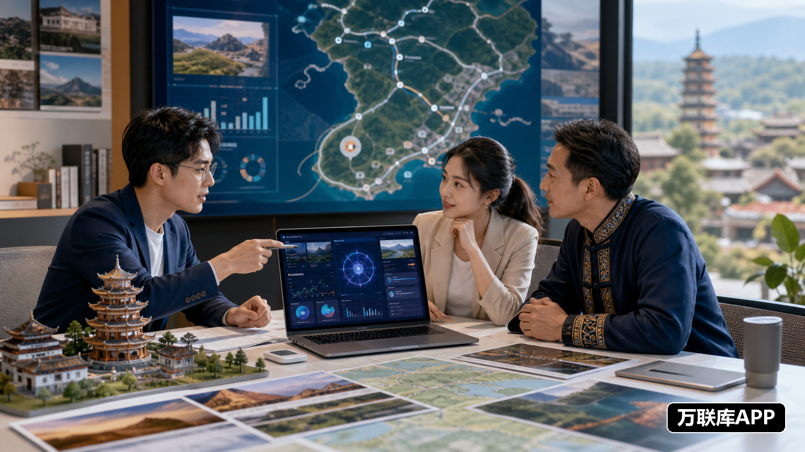

文旅行业的AI创业机会，已经从单纯的内容生成，逐渐延伸到游客服务、商家运营和城市资源协作。对项目方来说，真正需要解决的问题不是“有没有AI工具”，而是怎样让工具进入景区、酒店、商户和本地服务团队的日常工作。

因此，城市运营商招募的重点，不是寻找一个只负责转发资料的人，而是找到能够在本地完成客户拓展、产品演示、试点执行和持续维护的合作团队。

## AI文旅项目可以落地在哪些环节

### 内容生产与目的地推广

景区、酒店、文旅街区和地方品牌都需要短视频、图文、活动宣传和多语言内容。AI可以辅助完成选题整理、脚本初稿、素材改写和批量制作，城市团队则负责采集真实场景、补充本地信息并推进发布。

适合抖音生活服务、微信视频号等内容场景的项目，通常需要本地拍摄、账号运营和商家协作能力。运营商可以把景点、节庆活动和特色商户转化成更容易传播的内容主题。

### 行程规划与游客服务

游客在出行前关心路线、景点组合、交通和周边消费。AI可以辅助整理景区资料、生成主题行程，并根据亲子游、周末游或文化体验等需求提供建议。

如果项目需要结合高德地图等出行场景，城市运营团队还要负责核对本地路线、景点信息和服务商资源，确保线上内容能够对应真实体验。

### 景区和商家的数字化运营

文旅项目的服务对象还包括民宿、餐饮店、文创店、活动场馆和旅行社。AI可以用于商品文案、活动策划、客户咨询、评价整理和营销素材制作。

拥有本地商家网络的运营商，可以先从一个商圈或一类商户开始试点，再根据使用反馈调整工具和服务流程。需要团购、套餐或本地消费推广时，也可以结合美团等生活服务场景开展协作。

### 地方资源整合

许多城市拥有景点、非遗、演出、民宿和特色商品，但资源分散，缺少持续运营。AI可以帮助整理资料、生成宣传内容、设计主题线路，并提高项目方与商户之间的信息协作效率。

这类项目更依赖本地团队，因为资源收集、关系维护和线下执行都需要长期投入。

## 城市运营商需要承担哪些工作

城市运营商通常要完成四类工作：找到景区、酒店、商户和活动方；了解他们在获客、内容或服务上的实际需求；协助项目方完成产品演示和试点；在合作开始后跟进反馈和日常维护。

如果项目涉及内容推广，运营商还可能负责本地素材采集、达人或账号协调；如果项目面向商户，则要跟进使用情况、客户反馈和后续服务。运营商的价值，体现在把项目方案转化为本地可以执行的流程。

## 哪些团队更适合参与

熟悉景区、旅行社、酒店和民宿资源的文旅服务团队，适合负责客户拓展与区域合作；拥有短视频、直播或本地生活运营经验的团队，适合执行内容推广和商家获客；具备软件实施、系统培训和客户服务能力的团队，适合帮助商户完成工具落地。

拥有活动执行人员、商户网络或区域销售队伍的服务商，也可以参与城市运营。团队规模不一定要很大，但需要说明覆盖区域、现有资源、人员安排和可投入时间。

## 万联库APP：发布文旅AI城市合作需求

如果项目方正在招募文旅AI城市运营商，可以在万联库APP发布具体的区域合作需求。

需求中可以写明目标城市、服务对象、AI方案要解决的问题、试点范围和运营商需要承担的工作。是寻找景区渠道、商家资源、内容团队，还是负责本地客户拓展，都应当分别写清楚。

拥有文旅资源、商户网络、短视频团队或区域服务能力的合作方，也可以根据项目要求主动沟通。先围绕一个城市或一项具体任务试合作，再决定是否扩大范围，更容易找到适合长期配合的团队。

## 招募信息要具备执行细节

“诚招全国城市运营商”只能表达合作意向，无法帮助团队判断是否匹配。更有效的信息，应该说明项目所在的文旅场景、需要运营商完成的任务、项目方提供的工具和支持，以及合作方需要投入的资源。

如果需要商家拓展，要写出目标客户；如果需要内容推广，要说明内容形式和发布场景；如果需要区域服务，则要明确城市范围、试点周期和交付要求。

文旅AI项目能否发展起来，最终取决于技术方案是否能解决真实问题，以及城市运营商能否持续把项目落到本地。把合作目标、任务分工和资源要求讲清楚，项目方才更容易找到真正匹配的长期伙伴。
