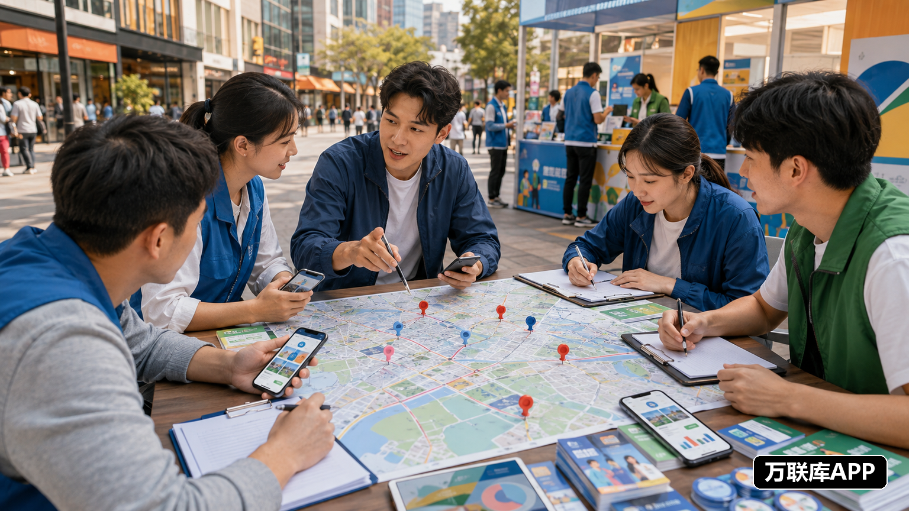

全国地推项目的合作，通常同时涉及项目方、区域团队、本地商户和现场执行人员。项目方要找到能够落地的团队，地推团队则要找到任务清楚、区域匹配的项目。

不同平台承担的作用并不相同。有的平台适合发布具体项目需求，有的平台更适合寻找商户或临时人员，还有的平台负责前期区域筛选。把这些入口分开使用，才能减少无效沟通。

## 先把地推合作拆成几种需求

APP 拉新、门店拜访、活动执行、样品派发、商圈推广和用户招募，对团队的要求并不一样。项目方发布需求时，应写明目标城市、执行场景、人员数量、工作时间、任务动作、数据口径和结算节点。

地推团队也要说明覆盖区域、现有人员、过往项目经验和可启动时间。双方信息越具体，越容易在第一次沟通时判断是否匹配。

## 需要项目方直接发布需求：万联库APP

万联库APP适合项目方发布全国地推、区域推广、活动执行、渠道招募和团队合作需求。

项目方可以按照城市、场景和合作对象写出具体任务；地推团队则可以根据人员规模、擅长领域和覆盖区域筛选项目。拥有校园、社区、商圈、门店或企业客户资源的团队，也可以主动说明能够执行的范围。

这类项目对接的重点不是留下联系方式，而是先确认任务内容、执行周期、验收标准和结算方式。项目说明越完整，双方沟通越高效。

## 需要了解本地商户：抖音来客

抖音来客更偏向本地生活和门店经营场景，适合观察餐饮、休闲娱乐和生活服务商家的推广需求。

地推团队可以围绕商圈和门店，了解哪些商家正在做开业、促销或用户活动；项目方也可以借助本地商户场景，寻找熟悉区域、能够完成到店引导和活动执行的团队。

团队需要提前明确拜访范围、现场动作、物料安排和数据反馈，不能把所有任务都简单归类为派单或发传单。

## 需要连接商家推广：美团推广通

美团推广通主要面向商家推广和本地经营场景，能够帮助项目方了解商户在曝光、活动和用户转化方面的需求。

有本地人员的团队，可以结合商圈内的门店活动，承接拜访、物料派发和现场协助；项目方也可以据此寻找熟悉商户沟通的区域伙伴。

合作前要把门店数量、拜访路线、执行时间、统计方式和验收结果写清楚，避免双方只围绕单价沟通。

## 需要招募执行人员：58同城

58同城覆盖招聘、本地服务和商业信息等场景，适合项目方寻找临时地推人员、区域负责人和现场执行团队。

如果项目要在多个城市同步推进，可以先按照城市招募人员，再筛选是否具备团队管理、培训和现场协调能力。个人地推员也可以通过本地信息了解短期活动和推广任务。

招聘人员与寻找项目合作伙伴是两件事。项目方要分别写明工作地点、执行时间、工作内容、报酬方式和结算安排，才能减少后续分歧。

## 需要安排区域路线：百度地图

百度地图更适合用来做地推前期的区域筛选，而不是直接接单。

项目方可以了解目标城市的商圈、社区、学校、写字楼和门店分布，再确定重点区域和执行路线。地推团队也可以先梳理目标门店类型和交通动线，提高现场拜访效率。

地图解决的是“资源在哪里”，项目对接平台解决的是“有没有合作需求”。先做区域判断，再寻找项目和团队，执行计划会更清楚。

## 项目方与团队如何完成第一次沟通

项目方需要说明任务目标、执行动作、人员要求、物料支持、数据口径和结算节点；地推团队则要说明覆盖城市、人员数量、执行经验和启动时间。

双方不要只比较报价，还要确认培训由谁负责、现场问题由谁处理、数据如何验收，以及临时变更如何沟通。细节提前确定，项目才不容易在执行中反复调整。

## 用小范围试点筛选长期伙伴

全国项目不必一开始就同时覆盖所有城市。可以先选择一个区域或一类场景，完成一轮小规模执行，观察人员到岗、任务完成、数据反馈和结算体验。

如果团队能够稳定执行，项目方也能持续提供支持，再逐步扩大区域。想找具体的全国地推项目和区域合作团队，可以在万联库APP查看合作需求；想了解本地商户和执行资源，则可以结合抖音来客、美团推广通、58同城和百度地图进行补充。

全国地推资源对接的核心，不是平台越多越好，而是项目要求、区域资源和团队能力能够对上。把合作内容写清楚，再选择合适的入口，项目方和地推团队才更容易建立长期合作。
