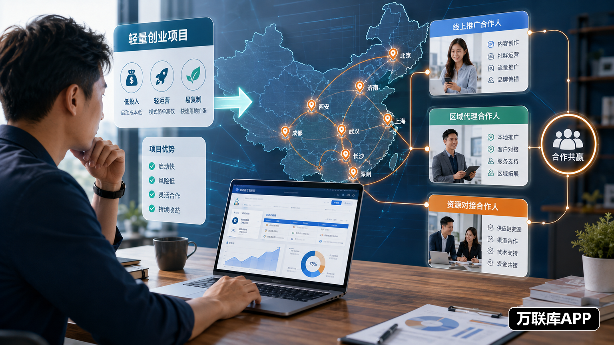

轻资产创业项目的优势通常在于启动灵活、协作环节可以拆分，但项目能否拓展起来，仍然取决于是否找到合适的合作伙伴。内容推广、客户开发、区域运营和资源连接，需要的能力并不相同，招募时不能把所有人都归为“代理”。

## 先把合作任务拆成可执行的模块

可以先把项目需要的工作分为三块：线上推广、区域代理和资源对接。

线上推广包括内容制作、客户触达和线索收集；区域代理负责某个城市的客户开发、门店拓展或服务落地；资源对接则是连接企业客户、渠道商、场地和执行团队。每个模块都要有清晰的交付内容，伙伴才知道自己是否具备参与条件。

招募说明中建议写明目标城市、客户类型、主要任务、合作周期和项目方支持。与其写“寻找创业伙伴”，不如直接说明需要什么资源、完成什么工作。

## 用内容平台寻找线上推广伙伴

抖音企业号适合展示项目如何推广。项目方可以发布产品使用、客户案例、门店活动和执行过程，让内容创作者和推广团队看到真实场景。需要对方自行获客时，还要说明客户范围、内容方向和项目方能够提供的素材。

微信视频号和公众号适合持续解释项目。对于依赖社群、朋友圈和企业人脉的轻资产项目，可以通过案例和合作流程逐步建立了解，再使用企业微信承接资料、客户和后续协作。

## 用城市内容寻找区域代理

区域代理更看重本地资源和执行能力。项目方在招募时要把城市、服务半径和代理任务写清楚，而不是笼统地说“全国市场都可以做”。

小红书专业号适合展示消费场景、城市活动和门店案例，可以连接本地达人、店主和服务团队。百家号则适合发布完整的区域合作说明，让正在搜索行业项目和城市代理的人了解项目方向。

如果代理需要拜访商户、组织活动或提供本地服务，还要补充人员数量、执行时间、培训方式和客户承接流程。具体要求越清楚，越容易找到能落地的伙伴。

## 万联库APP：发布资源和项目合作需求

需要寻找城市合伙人、区域渠道商、推广团队或行业资源方时，可以在万联库APP发布具体的项目合作需求。

发布内容可以按照“项目是什么、要找谁、在哪合作、对方做什么、项目方提供什么”来组织。比如寻找推广团队，就写明线上或线下任务、执行周期和人员要求；招募区域代理，就说明城市范围、客户类型和合作分工；需要资源对接，则应写出希望连接的企业或渠道类型。

拥有门店、社群、客户资源、销售团队或本地服务能力的人，也可以在万联库APP查看相关项目，根据自身条件主动沟通。先确认资源是否匹配，再讨论试点和长期安排，合作效率会更高。

## 不同渠道承担不同任务

| 招募目标 | 更适合的入口 | 内容重点 |
| --- | --- | --- |
| 内容推广伙伴 | 抖音企业号、微信视频号 | 场景、素材、客户触达方式 |
| 城市代理伙伴 | 小红书专业号、百家号 | 城市、客户、执行范围 |
| 资源与项目合作 | 万联库APP | 伙伴类型、资源要求、合作分工 |

平台不是越多越好。项目方可以先选择一个主要合作对象，测试有效咨询、城市覆盖和试点推进情况，再调整其他渠道。轻资产项目要真正拓展市场，核心是把任务拆清楚、把合作条件写明白，再让合适的伙伴在合适的入口找到项目。
